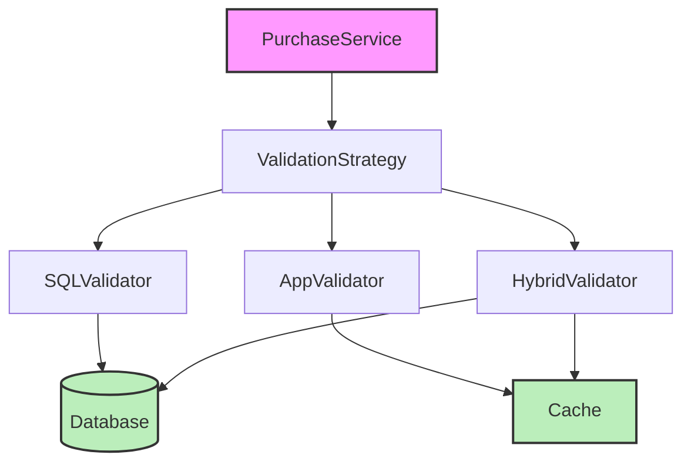
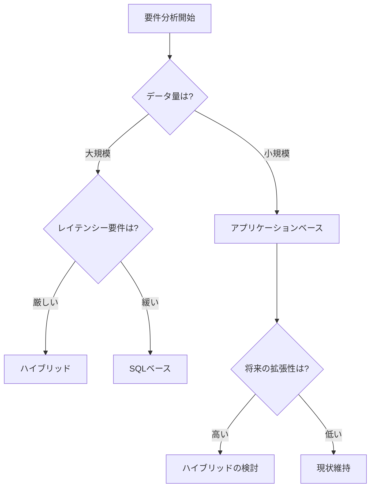

# 商品購入制限の実装設計

## 1. 実装アプローチの比較

### 1.1 SQLベースのバリデーション

```typescript
interface PaymentRecordRepo {
  hasRecentPurchase(userId: string, productId: string): Promise<boolean>;
  getPurchasesBy(userId: string): Promise<Purchase[]>; // 既存メソッド
}

class SqlBasedPurchaseRepository implements PaymentRecordRepo {
  async hasRecentPurchase(userId: string, productId: string): Promise<boolean> {
    const query = `
      SELECT COUNT(*) as count
      FROM purchases
      WHERE user_id = ? 
      AND product_id = ?
      AND completed_at >= DATE_SUB(NOW(), INTERVAL 1 YEAR)
      AND succeeded = true
    `;
    const result = await this.db.query(query, [userId, productId]);
    return result[0].count > 0;
  }
}
```

#### メリット
- データベースの最新状態を直接確認可能
- インデックスを活用した高速な検索
- メモリ使用量の削減

#### デメリット
- 毎回のデータベースアクセスによるレイテンシー
- データベース負荷の増加
- 複雑なバリデーションルールの実装が困難

### 1.2 アプリケーションベースのバリデーション

```typescript
class CachedPurchaseValidator {
  private cache: LRUCache<string, Purchase[]>;

  constructor(private repo: PaymentRecordRepo) {
    this.cache = new LRUCache({
      max: 1000, // キャッシュサイズ
      ttl: 1000 * 60 * 5 // 5分のTTL
    });
  }

  async validate(userId: string, productId: string): Promise<ValidationResult> {
    let purchases = this.cache.get(userId);
    if (!purchases) {
      purchases = await this.repo.getPurchasesBy(userId);
      this.cache.set(userId, purchases);
    }

    const oneYearAgo = new Date();
    oneYearAgo.setFullYear(oneYearAgo.getFullYear() - 1);

    const hasPurchase = purchases.some(p => 
      p.productId === productId && 
      p.transaction.succeeded &&
      p.transaction.completedAt >= oneYearAgo
    );

    return {
      isValid: !hasPurchase,
      error: hasPurchase ? new PurchaseLimitError(productId) : undefined
    };
  }
}
```

#### メリット
- キャッシュによる高速な検証
- 複雑なバリデーションルールの実装が容易
- データベース負荷の軽減

#### デメリット
- メモリ使用量の増加
- キャッシュの整合性管理が必要
- キャッシュミス時のレイテンシー

### 1.3 ハイブリッドアプローチ

```typescript
class HybridPurchaseValidator {
  constructor(
    private cache: CachedPurchaseValidator,
    private sql: SqlBasedPurchaseRepository
  ) {}

  async validate(userId: string, productId: string): Promise<ValidationResult> {
    // 1. まずキャッシュをチェック
    try {
      const cacheResult = await this.cache.validate(userId, productId);
      if (!cacheResult.isValid) {
        return cacheResult;
      }
    } catch (error) {
      // キャッシュエラーは無視して次のステップへ
      console.warn('Cache validation failed:', error);
    }

    // 2. SQLで最終確認
    const hasPurchase = await this.sql.hasRecentPurchase(userId, productId);
    return {
      isValid: !hasPurchase,
      error: hasPurchase ? new PurchaseLimitError(productId) : undefined
    };
  }
}
```

#### メリット
- キャッシュと最新データの両方を活用
- 高い信頼性と性能のバランス
- システム障害への耐性

#### デメリット
- 実装の複雑性
- 両方のシステムのメンテナンスが必要
- わずかなオーバーヘッド

## 2. アーキテクチャ図



## 3. 判断基準のフローチャート



## 4. 選択基準

### 4.1 SQLベースを選択する場合
- データの一貫性が最重要
- メモリリソースが限られている
- シンプルな実装が求められる
- データ量が中規模以下

### 4.2 アプリケーションベースを選択する場合
- レイテンシーが重要
- メモリリソースに余裕がある
- 複雑なバリデーションルールがある
- データ量が少ない

### 4.3 ハイブリッドを選択する場合
- 高可用性が求められる
- パフォーマンスと一貫性の両方が重要
- リソースに余裕がある
- 大規模なシステム

## 5. 将来の拡張性への対応

### 5.1 新しいバリデーションルールの追加

```typescript
// Strategy Pattern for Validation Rules
interface ValidationRule {
  validate(purchase: Purchase, context: ValidationContext): Promise<ValidationResult>;
}

class YearlyLimitRule implements ValidationRule {
  async validate(purchase: Purchase, context: ValidationContext): Promise<ValidationResult> {
    // 実装
  }
}

class ThreeMonthLimitRule implements ValidationRule {
  async validate(purchase: Purchase, context: ValidationContext): Promise<ValidationResult> {
    // 実装
  }
}

class PremiumUserRule implements ValidationRule {
  async validate(purchase: Purchase, context: ValidationContext): Promise<ValidationResult> {
    // 実装
  }
}
```

### 5.2 マイクロサービス化への対応

```typescript
interface ValidationService {
  validate(request: ValidationRequest): Promise<ValidationResponse>;
}

class ValidationServiceImpl implements ValidationService {
  constructor(private rules: ValidationRule[]) {}

  async validate(request: ValidationRequest): Promise<ValidationResponse> {
    // 実装
  }
}
```

## 6. パフォーマンス最適化のポイント

### 6.1 インデックス設計
```sql
-- 効率的なクエリのためのインデックス
CREATE INDEX idx_purchase_validation ON purchases (
  user_id,
  product_id,
  completed_at,
  succeeded
);
```

### 6.2 キャッシュ戦略
```typescript
interface CacheStrategy {
  get(key: string): Promise<any>;
  set(key: string, value: any): Promise<void>;
  invalidate(key: string): Promise<void>;
}

class RedisCacheStrategy implements CacheStrategy {
  // 実装
}

class MemoryCacheStrategy implements CacheStrategy {
  // 実装
}
```

## 7. 実装時の注意点

### 7.1 デッドロック対策
- トランザクション分離レベルの適切な設定
- タイムアウト設定
- リトライメカニズムの実装

### 7.2 エラーハンドリング
```typescript
class ValidationError extends Error {
  constructor(
    public readonly code: string,
    public readonly details: Record<string, any>
  ) {
    super(`Validation failed: ${code}`);
  }
}

class ValidationService {
  async validate(request: ValidationRequest): Promise<ValidationResponse> {
    try {
      // バリデーションロジック
    } catch (error) {
      if (error instanceof ValidationError) {
        // 既知のエラー処理
      } else {
        // 予期せぬエラー処理
      }
    }
  }
}
```

### 7.3 監視とロギング
- パフォーマンスメトリクスの収集
- キャッシュヒット率の監視
- エラーレートの監視

## 8. 結論

システムの要件や制約に応じて適切なアプローチを選択することが重要です。以下の点を考慮して判断してください：

1. システムの規模と成長予測
2. パフォーマンス要件
3. リソース制約
4. 保守性と拡張性の要求
5. チームの技術力とリソース

初期段階では単純なアプローチから始め、必要に応じて段階的に改善していくことを推奨します。
